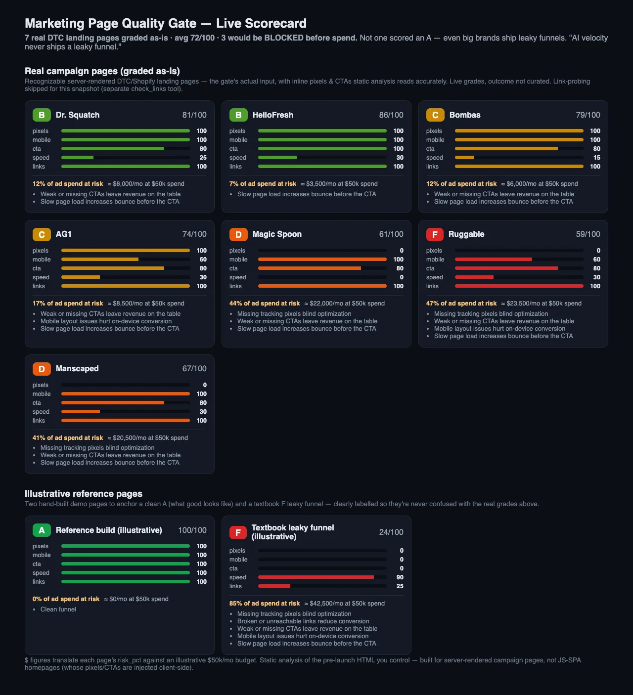

# Marketing Page Quality Gate — MCP Server

> **Stop paying to send traffic to leaky pages.**
> *AI velocity never ships a leaky funnel.*

A media-buying team ships AI-generated landing pages at velocity. The expensive failure mode
isn't ugly copy — it's a **leaky funnel** silently burning ad spend: a missing Meta Pixel so you
can't retarget or even *measure*, a CTA buried below the fold, a fixed-width shell that
horizontal-scrolls on every phone, a 1.5MB page that bounces before it paints, a dead link in the
hero. None of it shows up in a glance. Every one of them wastes budget.

This is an **MCP server** that scores any landing page **deterministically — the same page always
gets the same grade** — and translates each defect into **dollars of ad spend at risk**, so a page
gets *gated before a dollar of budget hits it*. CodeSieve-for-marketing-pages.

It does two things:

1. **Quality Gate (real, working core).** Score a page A–F on the signals that move conversion,
   get the **% of ad spend at risk**, and **block spend on sub-C pages** — all deterministic, no
   API keys, offline.
2. **Ad-platform connector (Half-A).** Campaign metrics for Meta / Google / Taboola / TikTok —
   **mocked** demo data (`"mock": true`), plus a **real CSV-export reader** so the spend gate runs
   on your actual numbers today. Live API keys are a documented TODO.

---

## See it on real pages

We graded **7 recognizable DTC landing pages as-is** (Dr. Squatch, HelloFresh, Bombas, AG1, Magic
Spoon, Ruggable, Manscaped). **Not one scored an A** — even big brands ship leaky funnels.



Regenerate it yourself: `PYTHONPATH=. uv run python examples/build_scorecard.py` → `report/scorecard.html`.

**▶ 90-second demo video:** [`demo/demo_video.mp4`](demo/demo_video.mp4) — the gate scoring a leaky page
F, a clean page A, blocking $10,711 of spend, and the live scorecard. (Script: `demo/VIDEO_SCRIPT.md`.)

---

## The tools (8)

| Tool | What it returns |
|------|-----------------|
| `score_page(url \| html)` | **A–F grade** + per-signal scores + **% spend at risk** |
| `gate_spend(url \| html, platform_csv)` | **PASS/BLOCK** verdict + **$ at risk** — refuses to greenlight a sub-C page |
| `detect_pixels(url \| html)` | Meta Pixel / GA4 / GTM / TikTok presence |
| `audit_mobile(url \| html)` | Viewport, responsiveness, horizontal-scroll risk |
| `audit_speed(url \| html)` | HTML weight, render-blocking scripts, layout-shift images |
| `cta_clarity(url \| html)` | Primary CTA presence, count, above-the-fold |
| `check_links(url \| html)` | Broken / internal / outbound links with HTTP status codes |
| `get_campaign_metrics(platform)` | **MOCKED** spend / ROAS / creative perf (`"mock": true`) |

Page tools take **either** a live `url` (fetched server-side) **or** raw `html` — so you score AI
output *before* it's ever deployed.

### Sample `score_page` output

```json
{
  "grade": "B",
  "score": 85,
  "signals": { "pixels": 0, "mobile": 100, "cta": 100, "speed": 100, "links": 100 },
  "spend_at_risk": {
    "risk_pct": 30,
    "factors": ["Missing tracking pixels blind optimization"]
  }
}
```

### The grade

Five conversion signals, weights sum to 1.0 (`links .25, mobile .20, cta .20, speed .20,
pixels .15`), mapped to a letter: `A≥90 · B≥80 · C≥70 · D≥60 · else F`.

### Spend at risk (think like a buyer, not a QA engineer)

The dollar lens differs from the quality lens. A **missing pixel is the single biggest dollar
leak** — with no pixel you can't measure conversions, can't optimize, can't build retargeting
audiences: *the entire budget runs blind*. So in `spend_at_risk`, pixels rank **top**
(`pixels 30, links 25, cta 20, mobile 15, speed 10`). `gate_spend` multiplies that risk by your
real CSV spend and **blocks** any page below a C.

---

## Run it

Requires **Python 3.14** and [`uv`](https://docs.astral.sh/uv/).

```bash
uv sync                                 # install deps (mcp, beautifulsoup4, httpx)
uv run pytest -q                        # 54/54 — the deterministic oracle
uv run python -m quality_gate.server    # start the MCP server (stdio)
```

A no-MCP taste of the scoring: `PYTHONPATH=. uv run python demo/show.py score fixtures/leaky_funnel.html`.

### Register with an MCP client

Claude Code (one-liner):

```bash
claude mcp add quality-gate -- uv --directory /path/to/itstoday-entry run python -m quality_gate.server
```

Claude Desktop (`~/Library/Application Support/Claude/claude_desktop_config.json` on macOS):

```json
{
  "mcpServers": {
    "marketing-page-quality-gate": {
      "command": "uv",
      "args": ["--directory", "/path/to/itstoday-entry", "run", "python", "-m", "quality_gate.server"]
    }
  }
}
```

Then, in natural language: *"Gate spend on this landing page before we launch it"* → the agent
calls `gate_spend` and gets a PASS/BLOCK verdict with the dollars at risk.

---

## Scope & limits (read this — it's a strength)

This is **deterministic static analysis of the pre-launch HTML you control, before you spend.**
It's built for the buyer's real page type — **server-rendered campaign / DTC / affiliate landing
pages** (Shopify, ClickFunnels, Leadpages, Carrd, WordPress) where the pixel, CTA, and content are
in the HTML payload, exactly what static analysis reads accurately and what a CI/agent step can
gate in milliseconds with no browser.

It is **not** a JS-SPA homepage auditor. A React/Next homepage (e.g. a big SaaS marketing site)
injects its pixels and renders its CTAs *client-side after JS runs*, so static analysis of the
served HTML will under-report them. That's a deliberate boundary, not a miss: a pixel that only
fires after a heavy JS bundle genuinely misses fast-bounce conversions — and the page you're about
to gate in your pipeline is *your own pre-launch HTML*, which is static by definition.

## What's real vs. mocked (honest)

- **Quality Gate — real, working, deterministic.** No external keys. This is the demo.
- **Ad connectors — `get_campaign_metrics` is mocked** (`"mock": true`, with a `note` pointing at
  where real API keys plug into `connectors.py`). **`read_spend_csv` is real** — it parses an
  actual Meta/Google/Taboola Ads Manager CSV export so `gate_spend` works on live spend today.
  Nothing pretends to be a live API it isn't.

---

## How it was built — the Grok contract-loop

Built with a **deterministic contract loop**: Claude authored a `pytest` oracle
(`contract/pytest_oracle.py`, 54 criteria) testing every scorer against **fixture HTML pages with
known defects**; Grok built the implementation under `quality_gate/` until the oracle went green,
one passing criterion at a time (`build_loop.sh`). **Grok never grades itself** — the oracle does,
and the contract (`tests/`, `fixtures/`, `CONTRACT.md`) is protected from the builder. A 3-agent
review then found real bugs (CTA substring false-matches, pixel-id false positives, a
protocol-relative-URL crash, a `max-width` scroll-risk false positive) — each was fixed the same
way: **write a failing guard test first, then let the loop fix it against the oracle.**

```
contract/pytest_oracle.py   # the deterministic oracle (Claude-authored)
tests/                      # 54 acceptance tests = the contract
fixtures/                   # HTML pages with known defects
examples/                   # illustrative pages + the live scorecard generator
CONTRACT.md                 # exact spec Grok built against
build_loop.sh               # the Grok contract-loop
quality_gate/               # the implementation (Grok-built)
  pixels · mobile · cta · speed · links · scoring · connectors · gate · server
```

---

*Built for the It's Today Media build challenge · Marcin Dudek · marcin.dudek.dev@gmail.com*
